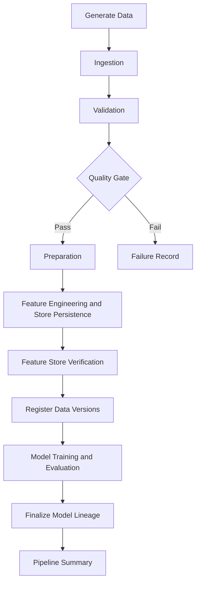

# RecoMart Pipeline Orchestration Design

## Purpose

Apache Airflow coordinates the existing RecoMart application services. The DAG
contains no generation, ingestion, validation, transformation, feature, lineage,
or modeling business logic. Each task calls the corresponding runner and treats
its manifest as the durable stage contract.

The primary DAG ID is `recomart_end_to_end_pipeline`. It is manual by default,
uses UTC, has `catchup=False`, and limits concurrency to one active DAG run.
`RECOMART_PIPELINE_SCHEDULE` may supply a cron expression without changing code.

## Invocation Strategy

The DAG uses direct Python application services because the existing runners
have stable typed APIs and return manifest data. `src/orchestration/stages.py`
adapts each return value to a compact JSON-safe contract. It does not reproduce
stage calculations. This preserves in-process exception context and avoids
parsing console output.

Feature calculation and feature-store persistence remain one task because the
existing `FeatureRunner` commits both transactionally. Versioning has two
orchestration steps: data artifacts are registered before training, then the
model and model-report versions are registered after training so the final
lineage graph can truthfully include artifacts that now exist.

## Runtime and Batch Context

`validate_runtime_configuration` creates:

- `pipeline_run_id`
- Airflow DAG run ID
- correlation ID
- optional RecoMart batch ID
- UTC start time
- validated runtime parameters

If a batch ID is supplied, generation is disabled and all downstream stages use
that same batch. Otherwise ingestion creates the authoritative batch ID after
optional generation. Run identifiers and manifest paths returned by every stage
are then propagated through XCom.

XCom contains only batch/run IDs, statuses, paths, row counts, quality metrics,
sparsity, database engine, MLflow run IDs, and model/report paths. DataFrames,
Parquet data, raw records, and full reports are never stored in XCom.

## Gates

The quality gate stops technical validation failures. In non-strict mode,
`SUCCESS` and `COMPLETED_WITH_QUALITY_ISSUES` continue. In strict mode only
`SUCCESS` with zero invalid records continues. The exception includes the score,
invalid count, and report path.

The feature-store gate requires a successful or idempotent feature batch, an
existing manifest, and positive user, item, and user-item feature counts.
Modeling cannot run before this gate and data-version registration succeed.

## Reliability Policy

| Stage | Retries | Delay | Timeout |
|---|---:|---:|---:|
| Generator | 1 | 1 minute | 10 minutes |
| Ingestion | 2 | 2 minutes | 15 minutes |
| Validation | 1 | default | 20 minutes |
| Preparation | 1 | default | 30 minutes |
| Feature engineering/store | 1 | default | 45 minutes |
| Versioning | 1 | default | 15 minutes |
| Modeling | 1 | 5 minutes | 60 minutes |
| Summary | 0 | none | 5 minutes |

Application retries handle recoverable HTTP/S3 operations. Airflow retries
recover whole tasks after infrastructure failure; deterministic quality-gate
failures are not retried.

For production, create optional pools `io_pool` (2 slots),
`database_pool` (1 slot), and `model_training_pool` (1 slot), then assign those
pool names through deployment policy. The local DAG does not require pre-created
pools.

## Failure Handling and Monitoring

Shared callbacks emit log notifications and write task failures to
`reports/orchestration/failures/dag_run_id=<id>/`. Callback errors are caught so
they cannot hide the original exception. Secrets embedded in common URLs are
masked.

The success summary writes:

- `pipeline_run_summary.json`
- `task_execution_summary.csv`
- `orchestration_report.md`
- `execution_evidence.txt`

These include durations, task states, retries, record/quality/feature/model
metrics, batch IDs, MLflow run IDs, and report paths.

## Idempotency and Security

Airflow does not bypass stage checksums or manifests. Existing
`IDEMPOTENT_SUCCESS` and compatible warning statuses are accepted. A supplied
batch is preserved across retries. Conflicting immutable artifacts raise the
existing application exception.

Credentials come from environment variables or Airflow Connections. DAG
parameters and Variables contain non-secret settings only. Database URLs,
access keys, tokens, and webhook secrets must never be placed in DAG run
configuration or logs.
